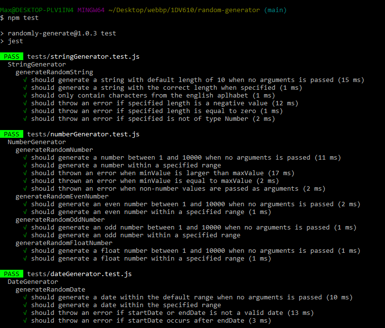

# Test report
Testing has been executed with automated unit-tests using the Jest framework. Each generator and its methods have been tested to make sure they returns the correct data and throws errors as expected.

If you would like to recreate the tests you can follow this basic workflow:
1. Clone the code from [GitHub](https://github.com/MaxGranberg/randomly-generate).
2. Navigate to the projects root directory in the terminal.
3. Run "npm install" to install dependencies.
4. Run "npm test" to execute the tests.

### Testresult

| What was tested                     | How it was tested                                   | Result       |
|-------------------------------------|---------------------------------------------------|----------------|
|**StringGenerator** -  Generate a string with a default length of 10 | Call generateRandomString() without arguments.| Passed |
|**StringGenerator** - Generate a string with a custom length | Call generateRandomString(5) with a custom length of 5. | Passed |
|**StringGenerator** - Error when a negative custom length is passed as an argument. | Call generateRandomString(-1) | Passed - Error thrown correctly.|
|**StringGenerator** - Error when custom length is zero. | Call generateRandomString(0) | Passed - Error thrown correcly.|
|**StringGenerator** - Error when argument is not a number| Call generateRandomString('test') | Passed - Error thrown correctly.|
|**StringGenerator** - String contains valid characters | Call generateRandomString(100) and checks the characters in the string with a .toMatch(/^[a-zA-Z]+$/). | Passed - Only contained characters from the english alphabet. |
|**NumberGenerator** - Generate a number in the default range | Call generateRandomNumbers() without arguments.| Passed - Generated a random number between 1 and 10 000.|
|**NumberGenerator** - Generate a random number within a specified range| Call generateRandomNumber(10,20) where the minimum value a number can be is 10 and the maximum 20.| Passed - Generated a random number in the specified range.|
|**NumberGenerator** - Error when minimum value argument is greater than the maximum value argument.| Call generateRandomNumber(30,20) | Passed - Error thrown correctly.|
|**NumberGenerator** - Error when minimum value argument is equal to the maximum value argument.| Call generateRandomNumber(20,20) | Passed - Error thrown correctly.|
|**NumberGenerator** - Error when arguments are not numbers | Call generateRandomNumbers('test', 20) and generateRandomNumber(30, 'a') | Passed - Error thrown correctly.|
|**DateGenerator** - Generate a date in the default range | Call generateRandomDate() without arguments. | Passed - Generated a random date bewteen 1900-01-01 and 2100-01-01|
|**DateGenerator** - Generate a date within a specified range.| Call generateRandomDate(startDate, endDate) where: startDate = new Date('1996-03-29) and endDate = new Date('2023-09-25') | Passed - Generated a random date within specified range.|
**DateGenerator** - Error when invalid date arguments are passed| Call generateRandomDate(startDate, endDate) where startDate and endDate are not valid Date objects.| Passed - Error thrown correctly.|
|**DateGenerator** - Error when startDate argument occurs after the endDate | Call generateRandomDate(startDate, endDate) where startDate = new Date('2024-05-01') and endDate = new Date('2023-12-12') | Passed - Error thrown correctly.|
|**ColorGenerator** - Generate a valid RGB color string| Call generateRandomRGBColor() and check that the string contains correct values. | Passed|
|**ColorGenerator** - Generate a valid HEX color string| Call generateRandomHexColor() and check that the string contains correct values. That the string .toMatch(/^#[0-9A-F]{6}$/) | Passed|
|**ArrayGenerator** - Generate an array of numbers with the default length | Call generateRandomNumbersArray() without any arguments. | Passed - Generated an array of numbers with a length of the default value 10.|
|**ArrayGenerator** - Generate an array of numbers with a custom length.| Call generateRandomArray(lengthOfArray) where: lengthOfArray = 14 | Passed - Generated an array of numbers with a length of 14.|
|**ArrayGenerator** - Generate an array of numbers with the number being within a specified range.| Call generateRandomNumbersArray(lengthOfArray, minValueInArray, maxValueInArray) where: lengthOfArray = 25 , minValueInArray = 2 , maxValueInArray = 15 | Passed - Generated an array with a length of 25 and only with numbers within the specified range.|
|**ArrayGenerator** - Error when minValueInArray argument is greater than or equal to maxValueInArray argument within the custom range.| Call generateRandomNumbersArray(lengthOfArray, minValueInArray, maxValueInArray) where : minValueInArray >= maxValueInArray | Passed - Error thrown correctly.|
|**ArrayGenerator** - Error when lengthOfArray argument is zero or negative | Call generateRandomNumbersArray(lengthOfArray) where: lengthOfArray = -5  , and generateRandomNumbersArray(lengthOfArray) where: lengthOfArray = 0 | Passed - Error thrown correctly.|
|**ArrayGenerator** - Error when range input arguments are non-numbers | Call generateRandomNumbersArray(15, "test", "test2") | Passed - Error thrown correctly.|
|**ArrayGenerator** - Error when custom length argument is not a number | Call generateRandomNumbersArray('test', 10, 20) | Passed - Error thrown correctly.
|**ArrayGenerator** - Generate an array of strings with the default length of 10. | Call generateRandomStringsArray() without any arguments. | Passed - Generated an array of string with a length of 10.|
|**ArrayGenerator** - Generate an array of strings with a custom arraylength.| Call generateRandomStringsArray(lengthOfArray) where: lengthOfArray = 7 | Passed - Generated an array of strings with an arraylength of 7.|
|**ArrayGenerator** - Generate an array of strings where each strings length are within a specified range.| Call generateRandomStringsArray(lengthOfArray, minStringLength, maxStringLength) where: lengthOfArray = 50 , minStringLength = 2 , maxStringLength = 15 | Passed - Generated an array with a length of 50 only containing strings with a minimum length of 2 and a maximum length of 15 characters.|
|**ArrayGenerator** - Error when minStringLength argument is greater than or equal to maxStringLength argument.| Call generateRandomStringsArray(5, minStringLength, maxStringLength) where: minStringLength >= maxStringLength | Passed - Error thrown correctly.|
|**ArrayGenerator** - Error when minStringLengthArgument is less than or equal to zero.| Call generateRandomStringsArray(10, minStringLength, 4) where: minStringLength <= 0 | Passed - Error thrown correctly.|
|**ArrayGenerator** - Error when lengthOfArray argument is less then or equal to zero.| Call generateRandomStringsArray(lengthOfArray) where lengthOfArray <= 0 | Passed - Error thrown correctly.|
|**ArrayGenerator** - Error if minStringLength and maxStringLength arguments are not numbers | Call generateRandomStringsArray(15, "hej", true) | Passed - Error thrown correctly.|
|**ArrayGenerator** - Error if lengthOfArray argument is not a number | Call generateRandomStringsArray("test", 10, 20) | Passed - Error thrown correctly.|

-------------
